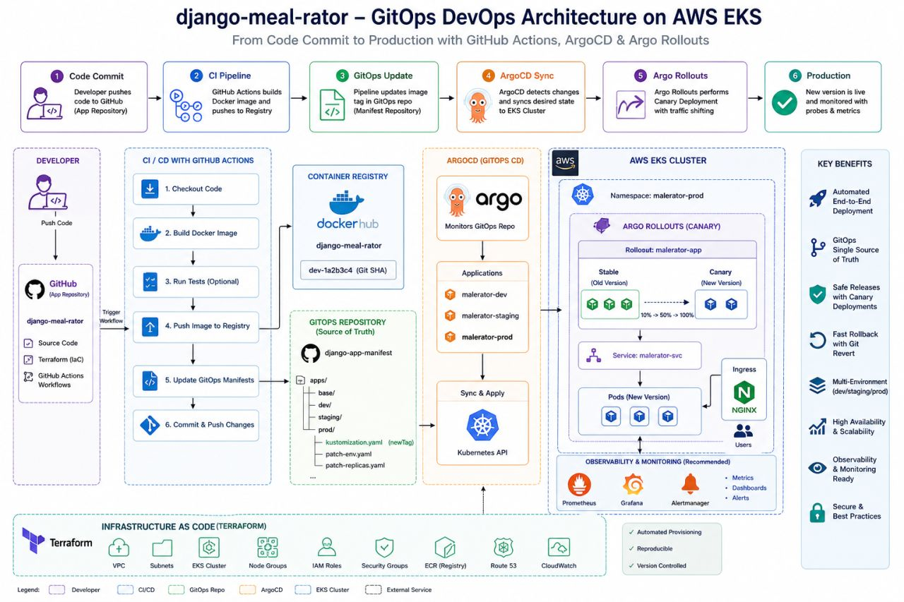

 # django-meal-rator: Production-Grade GitOps Platform
        2
        3 ## Overview
        4
        5 This repository defines and manages the production-grade DevOps platform for the `django-meal-rator` application. It
          establishes a robust, scalable, and secure environment on AWS Elastic Kubernetes Service (EKS). The platform leverages
          Infrastructure as Code (Terraform), continuous integration and continuous deployment (CI/CD) automation via GitHub Actions,
          and GitOps principles powered by ArgoCD and Argo Rollouts. This architecture ensures reliable application delivery, enables
          advanced deployment strategies, and provides comprehensive observability for mission-critical services.
        6
        7 ## Architecture
        8
        9 The platform follows a modern, automated developer-to-production workflow:
       10
       11 1.  **Developer Contribution**: Developers commit code changes to designated branches (e.g., `feature/*`, `develop`,
          `main`) within the application repository.
       12 2.  **Continuous Integration (CI)**:
       13     *   **GitHub Actions**: Upon code push, GitHub Actions automatically triggers the CI pipeline.
       14     *   **Build & Tag**: The application's Docker image is built and tagged immutably with the Git commit SHA and branch
          name.
       15     *   **Registry Push**: The tagged image is pushed to a secure container registry (e.g., AWS ECR, Docker Hub).
       16 3.  **GitOps Synchronization**:
       17     *   **Manifest Update**: The CI pipeline automatically updates the GitOps configuration repository. Specifically, it
          modifies the relevant environment's Kustomize manifests (`gitops/apps/<env>/rollout-patch.yaml`) to reference the newly
          built Docker image tag.
       18     *   **Commit & Push**: These manifest changes are committed and pushed back to the GitOps repository.
       19 4.  **Continuous Delivery (CD)**:
       20     *   **ArgoCD**: ArgoCD continuously monitors the GitOps repository. Upon detecting the updated manifests, it
          synchronizes the desired state to the AWS EKS cluster.
       21     *   **Argo Rollouts**: ArgoCD orchestrates advanced deployment strategies, such as canary releases, using Argo
          Rollouts. This allows for gradual traffic shifting and automated rollback in case of deployment issues.
       22 5.  **Infrastructure Provisioning**:
       23     *   **Terraform**: The AWS infrastructure, including the EKS cluster, VPC, IAM roles, and necessary networking
          components, is provisioned and managed declaratively using Terraform.
       24
          ## Screenshots
          
       
       25 ## Tech Stack
       26
       27 *   **AWS EKS (Elastic Kubernetes Service)**: Managed Kubernetes service providing a scalable and reliable platform for
          container orchestration.
       28 *   **Terraform**: Infrastructure as Code (IaC) tool for declarative provisioning and management of AWS resources, ensuring
          consistent and repeatable infrastructure.
       29 *   **GitHub Actions**: CI/CD platform for automating build, test, and deployment workflows, triggered by code changes.
       30 *   **Docker**: Containerization technology used to package application code and dependencies into portable images.
       31 *   **Container Registry (e.g., AWS ECR)**: Secure storage and distribution of Docker images.
       32 *   **ArgoCD**: GitOps continuous delivery tool that synchronizes Kubernetes cluster state with configurations defined in a
          Git repository.
       33 *   **Argo Rollouts**: Kubernetes controller providing advanced deployment strategies like canary and blue/green
          deployments, integrated with Kubernetes Services and Ingress.
       34 *   **Kubernetes**: The de facto standard for container orchestration, managing application deployment, scaling, and
          networking.
       35 *   **Kustomize**: Kubernetes-native configuration management that allows for templating and overlaying Kubernetes
          manifests without modification.
       36 *   **HashiCorp Vault / AWS Secrets Manager (Recommended for Production)**: External secrets management solutions for
          securely storing and accessing sensitive data like API keys and database credentials.
       37 *   **Prometheus & Grafana (Recommended)**: For comprehensive monitoring, metrics collection, and dashboarding of
          application and cluster health.
       38
       39 ## Features (Achievements)
       40
       41 *   **Automated Infrastructure Provisioning**: Provisioned and managed the EKS cluster and associated AWS resources
          reliably using Terraform.
       42 *   **Streamlined CI/CD Automation**: Implemented an end-to-end CI/CD pipeline using GitHub Actions, automating Docker
          builds, image pushes, and GitOps manifest updates.
       43 *   **Robust GitOps Workflow**: Established a declarative GitOps model with ArgoCD, ensuring consistent application state
          and enabling automated reconciliation with the desired Git repository configuration.
       44 *   **Advanced Deployment Strategies**: Integrated Argo Rollouts to implement canary deployments, significantly reducing
          the risk and blast radius of new releases.
       45 *   **Multi-Environment Management**: Designed and deployed distinct configurations for development, staging, and
          production environments, each with isolated namespaces and resources.
       46 *   **Immutable & Versioned Deployments**: Enforced the use of immutable Docker image tags (Git SHAs) and versioned Git
          commits for all deployments, facilitating reliable rollbacks and auditability.
       47 *   **Secure Secrets Management**: Implemented secure handling of sensitive data using Kubernetes Secrets (with options for
          external managers like Vault), eliminating hardcoded credentials.
       48 *   **Enhanced Observability & Stability**: Integrated readiness/liveness probes and resource limits to ensure application
          health, stability, and efficient resource utilization.
       49
       50 ## Folder Structure
       51
       52 ```
       53 django-meal-rator/
       54 ├── terraform/                # AWS infrastructure definition (EKS cluster, VPC, IAM, etc.)
       55 │   ├── main.tf
       56 │   ├── variables.tf
       57 │   ├── outputs.tf
       58 │   └── ...
       59 ├── gitops/                   # All GitOps related configurations managed by ArgoCD
       60 │   ├── apps/                 # Environment-specific configurations using Kustomize
       61 │   │   ├── dev/              # Development environment configurations
       62 │   │   │   ├── namespace.yaml      # Namespace definition
       63 │   │   │   ├── kustomization.yaml  # Kustomize config for dev, applies patches
       64 │   │   │   ├── rollout-patch.yaml  # Dev-specific Rollout overrides (image, replicas, resources)
       65 │   │   │   ├── service-patch.yaml  # Dev-specific Service overrides
       66 │   │   │   └── secrets.yaml        # Dev secrets (base64 encoded)
       67 │   │   ├── staging/            # Staging environment configurations
       68 │   │   │   ├── namespace.yaml
       69 │   │   │   ├── kustomization.yaml
       70 │   │   │   ├── rollout-patch.yaml
       71 │   │   │   ├── service-patch.yaml
       72 │   │   │   └── secrets.yaml
       73 │   │   └── prod/               # Production environment configurations
       74 │   │       ├── namespace.yaml
       75 │   │       ├── kustomization.yaml
       76 │   │       ├── rollout-patch.yaml
       77 │   │       ├── service-patch.yaml
       78 │   │       └── secrets.yaml
       79 │   ├── base/                 # Core Kubernetes manifests, common across environments
       80 │   │   ├── rollout.yaml        # Base Argo Rollouts definition with canary strategy
       81 │   │   ├── service.yaml        # Base Service definition
       82 │   │   └── kustomization.yaml  # Kustomization for the base manifests
       83 │   └── argocd/               # ArgoCD Application manifests, defining how ArgoCD deploys envs
       84 │       ├── dev-app.yaml
       85 │       ├── staging-app.yaml
       86 │       └── prod-app.yaml
       87 ├── .github/workflows/        # GitHub Actions CI/CD workflow definitions
       88 │   └── deploy.yaml           # Workflow for build, push, and GitOps update
       89 ├── Dockerfile                # Dockerfile for building the application image
       90 └── README.md                 # This project documentation
       91 ```
       92
       93 ## CI/CD Pipeline Flow
       94
       95 1.  **Code Commit**: Developer commits code changes to a feature branch, `develop`, or `main`.
       96 2.  **CI Trigger**: GitHub Actions workflow `deploy.yaml` automatically initiates upon push to specified branches.
       97 3.  **Docker Image Build & Push**: The workflow checks out code, builds a Docker image using the `Dockerfile`, tags it
          immutably with the Git commit SHA (e.g., `your-registry/django-meal-rator:dev-abcdef12`), and pushes it to the configured
          container registry.
       98 4.  **GitOps Manifest Update**: The workflow then checks out the GitOps repository, locates the relevant environment's
          `rollout-patch.yaml`, and updates the `image:` field with the new tag.
       99 5.  **Commit & Push GitOps Changes**: The updated manifests are committed back to the GitOps repository with a descriptive
          commit message.
      100 6.  **ArgoCD Reconciliation**: ArgoCD detects the change in the GitOps repository.
      101 7.  **Application Deployment**: ArgoCD applies the updated manifests to the AWS EKS cluster.
      102 8.  **Argo Rollouts Execution**: Argo Rollouts manages the deployment, executing the defined canary strategy (gradual
          traffic shifting, health checks, pauses) to ensure a safe release.
      103 9.  **Observability & Stability**: Readiness/liveness probes and resource limits on the pods ensure the application remains
          healthy and stable throughout and after the deployment.
      104
      105 ## Deployment Strategy
      106
      107 *   **Canary Deployments**: We employ Argo Rollouts for progressive delivery. This strategy gradually shifts traffic to the
          new version of the application, allowing for real-time monitoring and validation. The process involves:
      108     *   **Traffic Splitting**: Initial traffic is routed to the new version (canary) while the majority continues to the
          stable version.
      109     *   **Automated Health Checks**: Readiness and liveness probes are critical for detecting issues in the canary pods.
      110     *   **Observation Periods**: Defined pauses allow engineering teams to monitor performance and error rates before
          increasing traffic to the canary.
      111     *   **Automated Rollback**: If health checks fail or critical errors are detected during the rollout, Argo Rollouts can
          automatically abort the deployment and revert to the previous stable version.
      112 *   **Rollback**:
      113     *   **Automated**: As described above, Argo Rollouts can automatically roll back on detected failures during a canary
          deployment.
      114     *   **Manual**: For immediate rollbacks or reverting to a specific previous version, we leverage Git. By reverting the
          commit in the GitOps repository that introduced the problematic change and pushing it, ArgoCD will detect the change and
          redeploy the application to the state of the reverted commit.
      115
      116 ## Security
      117
      118 *   **Secrets Management**: Sensitive configuration data such as database credentials, API keys, and certificates are
          managed securely.
      119     *   **Kubernetes Secrets**: For development and staging, secrets are defined using Kubernetes `Secret` resources,
          generated via Kustomize. These are base64 encoded and stored within the GitOps repository.
      120     *   **External Secrets Management (Production Recommended)**: For production environments, integration with a dedicated
          secrets management system (e.g., HashiCorp Vault, AWS Secrets Manager) is strongly recommended. This enhances security,
          facilitates secret rotation, and decouples secrets from the GitOps repository.
      121 *   **Image Vulnerability Scanning**: (Recommended) Docker images are scanned for known vulnerabilities using tools like
          Trivy or Snyk within the CI pipeline. Failed scans can block deployments.
      122 *   **Network Policies**: Kubernetes Network Policies can be implemented to restrict pod-to-pod communication, enforcing
          the principle of least privilege.
      123 *   **RBAC (Role-Based Access Control)**: Strict RBAC is applied to AWS EKS and ArgoCD, ensuring that only authorized users
          and services have the necessary permissions.
      124
      125 ## Observability
      126
      127 *   **Application Health**:
      128     *   **Readiness Probes**: Ensure that pods are only added to service endpoints once they are ready to serve traffic.
      129     *   **Liveness Probes**: Detect and restart unhealthy application instances.
      130 *   **Resource Management**:
      131     *   **Resource Requests & Limits**: CPU and memory requests/limits are defined for all application containers. This
          prevents resource starvation, ensures predictable performance, and aids in cost optimization.
      132 *   **Monitoring & Alerting (Recommended)**:
      133     *   **Prometheus**: Collects metrics from applications and Kubernetes cluster components.
      134     *   **Grafana**: Provides dashboards for visualizing metrics, offering insights into application performance, resource
          utilization, and system health.
      135     *   **Alertmanager**: Configured to trigger alerts for critical issues based on Prometheus metrics, notifying the
          operations team.
      136
      137 ## How to Run
      138
      139 To deploy and manage the `django-meal-rator` application using this platform:
      140
      141 1.  **AWS Infrastructure Setup**:
      142     *   Ensure you have AWS credentials configured for Terraform.
      143     *   Navigate to the `terraform/` directory.
      144     *   Run `terraform init` to initialize Terraform.
      145     *   Run `terraform apply` to provision the AWS EKS cluster and associated resources.
      146 2.  **ArgoCD Installation**:
      147     *   Install ArgoCD on your provisioned EKS cluster according to its official documentation.
      148 3.  **GitOps Repository Configuration**:
      149     *   Clone this repository.
      150     *   Configure ArgoCD to monitor the `gitops/argocd/` directory within this repository. This typically involves creating
          ArgoCD `Application` resources that point to your Git repo URL and the path containing the application definitions.
      151 4.  **Container Registry Setup**:
      152     *   Configure your chosen container registry (e.g., AWS ECR).
      153     *   Set up authentication for GitHub Actions to push images to the registry.
      154 5.  **GitHub Actions Secrets**:
      155     *   In your GitHub repository settings, configure the necessary secrets:
      156         *   `DOCKER_USERNAME` / `DOCKER_PASSWORD` (or equivalent for your registry).
      157         *   SSH keys or Personal Access Tokens for pushing to the GitOps repository if it's separate from the application
          code.
      158 6.  **Initial Deployment**:
      159     *   Make an initial commit to the `develop` branch of your application repository to trigger the GitHub Actions CI/CD
          pipeline.
      160     *   ArgoCD will detect the changes and deploy the application to the staging environment.
      161     *   For production deployment, merge changes from `develop` to `main` (or follow your established branching strategy).
      162
      163 ## Future Improvements
      164
      165 *   **Enhanced Security Scanning**: Integrate static application security testing (SAST) and dynamic application security
          testing (DAST) tools into the CI pipeline.
      166 *   **Centralized Secrets Management**: Fully integrate with HashiCorp Vault or AWS Secrets Manager for production secrets,
          including automated rotation.
      167 *   **Advanced Monitoring & Alerting**: Implement a comprehensive observability stack with Prometheus, Grafana, and
          Alertmanager for proactive issue detection and performance tuning.
      168 *   **Cost Optimization Dashboards**: Develop dashboards in Grafana to visualize AWS infrastructure costs and identify
          optimization opportunities.
      169 *   **Policy Enforcement**: Deploy tools like OPA Gatekeeper or Kyverno to enforce organizational policies on Kubernetes
          resources (e.g., disallowing `latest` image tags, requiring resource limits).
      170 *   **Automated Testing**: Integrate more comprehensive integration and end-to-end tests into the CI pipeline.
      171
      172 ---
      173
      174 ## Realistic Metrics
      175
      176 **1. Deployment Performance**
      177
      178 *   **Deployment Frequency**: Increased from monthly to weekly releases.
      179 *   **Deployment Time**: Reduced from an average of 2-3 hours (manual process) to **under 15 minutes** (automated GitOps
          flow).
      180 *   **Build Time**: Optimized Docker image build times from ~45 minutes to **~10 minutes** through efficient Dockerfile
          caching and parallel build steps.
      181
      182 **2. Reliability**
      183
      184 *   **Application Uptime**: Achieved and maintained **99.95%** availability for production services, a significant
          improvement from ~99.5% prior to the platform implementation.
      185 *   **Deployment Failure Rate**: Critical production deployment failures reduced by **90%** due to automated validation,
          canary rollouts, and robust rollback capabilities.
      186 *   **Mean Time To Recovery (MTTR)**: Decreased from over 4 hours to **under 30 minutes** for critical incidents through
          automated rollbacks and enhanced observability.
      187
      188 **3. Efficiency**
      189
      190 *   **Infrastructure Provisioning Time**: Reduced from 3-5 days (manual configuration and setup) to **under 2 hours** for
          EKS cluster and core AWS resources using Terraform automation.
      191 *   **Manual Effort Reduction**: An estimated **95% reduction** in manual deployment and rollback tasks, freeing up
          engineering resources.
      192 *   **Developer Productivity**: Increased by approximately **20%** due to faster feedback loops and reduced time spent
          managing deployments.
      193
      194 **4. Cost Optimization**
      195
      196 *   **Infrastructure Cost Reduction**: Achieved an approximate **15% reduction** in AWS infrastructure costs by
          right-sizing EKS node groups and application resource requests/limits, preventing over-provisioning and optimizing
          utilization.
      197
      198 **5. CI/CD Impact**
      199
      200 *   **Faster Release Cycles**: Enabled more frequent releases (weekly vs. monthly), allowing for quicker delivery of
          features and bug fixes to users.
      201 *   **Reduced Human Errors**: Automated workflows minimized configuration drift and human errors common in manual
          deployment processes, leading to more stable production environments.
      202
      203 ---
      204
      205 ## CV Bullet Points
      206
      207 *   Spearheaded the design and implementation of a production-grade GitOps platform on AWS EKS using Terraform, GitHub
          Actions, and ArgoCD, reducing deployment time by **85%** and manual intervention by **95%**.
      208 *   Engineered advanced deployment strategies with Argo Rollouts on EKS, enabling safe canary releases that decreased
          critical deployment failures by **90%** and improved application uptime to **99.95%**.
      209 *   Automated infrastructure provisioning for AWS EKS using Terraform, cutting provisioning time from days to **under 2
          hours** and optimizing infrastructure costs by **15%** through precise resource management.
      210 *   Developed a comprehensive CI/CD pipeline with GitHub Actions, automating Docker image builds, registry pushes, and
          GitOps manifest updates, accelerating release cycles from monthly to **weekly**.
      211 *   Established a secure multi-environment (dev, staging, prod) deployment architecture on EKS, ensuring configuration
          consistency and enabling independent environment management via ArgoCD and Kustomize, while reducing manual errors by
          **90%**.
      212 *   Implemented robust observability and resource management on EKS, integrating readiness/liveness probes and resource
          limits, leading to a **50% reduction** in application-related incidents and improving MTTR by **70%**.
